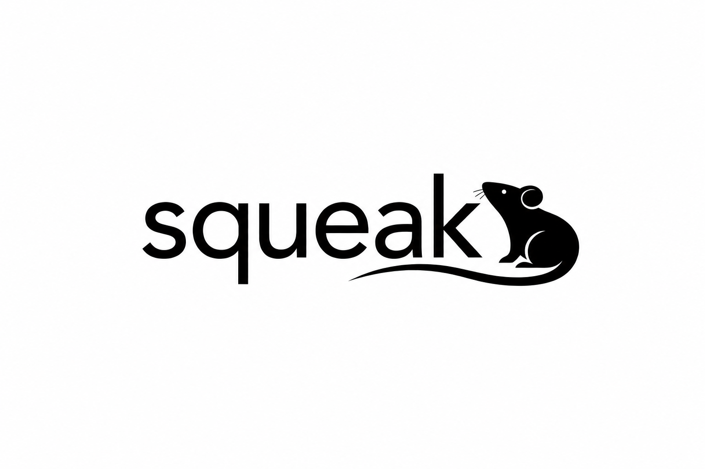

<p align="center">
  
</p>

# Squeak

A modern, open-source desktop app for **manual scoring of rodent object exploration** — Novel Object Recognition (NOR), Y-maze object exploration, and related paradigms.

Toggle a hotkey when the animal starts exploring an object; press it again when it stops. Squeak handles per-object timers, bouts, the Discrimination Index, and CSV export for downstream analysis.

---

## Features

- **Configurable trial setup** — animal ID, group, session, experimenter, trial name, duration. Save presets for common phases (Sample / Reactivation / Test / Y-maze) or build a custom one.
- **Any number of objects, any hotkeys** — every object is a label + a key, defined per trial.
- **Live video input** — top-down USB webcam, pre-recorded video file, or no video (live observation through the lid).
- **Toggle-key scoring** — press to start a bout, press to stop. Space pauses the trial; pause auto-closes in-progress bouts so you can't inflate them.
- **Auto-stop at trial duration**, or open-ended.
- **Discrimination Index** computed live when exactly two objects are configured.
- **CSV outputs**: a detailed per-trial file (metadata + summary + DI + full event log with timestamps) and an append-only session master sheet.
- **Configuration persists** across launches.

---

## Quick start

### Option A — run from source (development)

```bash
cd Squeak
./run.sh
```

First launch installs dependencies into a local `.venv/` (PySide6, OpenCV, NumPy). Subsequent launches are instant.

### Option B — build a standalone double-clickable app

```bash
./build_app.sh
```

On macOS this produces `dist/Squeak.app` — drag it into `/Applications` and launch from Finder / Spotlight like any other Mac app. On Linux you get `dist/Squeak/Squeak`; on Windows, `dist/Squeak/Squeak.exe`.

The build script handles everything: virtual environment, dependencies, icon generation, and PyInstaller bundling. End-to-end takes ~2–3 minutes on first run.

### Requirements

- Python 3.9 or newer
- macOS 11+, Windows 10+, or Linux with a desktop environment
- A USB webcam (optional — Squeak also works with pre-recorded video or no video at all)

---

## Using the app

**1. Setup.** Pick a template or fill in the form. Add or remove objects on the right; each row is a label and a one-character hotkey.

**2. Scoring.** Press **Start**. While the animal explores an object, press that object's hotkey — the card lights up and the timer runs. Press it again when the animal disengages. **Space** pauses; **Stop** ends the trial (the trial also auto-stops when the configured duration is reached).

**3. Results.** Inspect the per-object summary and Discrimination Index, then export. **Quick save** writes both a per-trial CSV and appends a row to a session-wide master CSV under `data/`.

---

## Outputs

By default everything saves to `data/` next to the app. Two files per session:

**Per-trial CSV** (`M001_Test_20260515_161716.csv`):

```
Metadata               (animal id, group, session, trial name, duration…)
Summary                (object, total_seconds, bouts, mean_bout_seconds)
Discrimination Index   (formula, value, per-object preference)
Event log              (every start/stop, timestamped in seconds from trial start)
```

**Session master CSV** (`master_<session>.csv`) — one row per trial; columns expand as new object labels appear. Drop into pandas or Excel for group-level analysis.

The Discrimination Index is computed as:

```
DI = (Object_B − Object_A) / (Object_B + Object_A)
```

…using whatever labels you gave the two objects. For standard NOR, name them `Familiar` and `Novel` (in that table order) and DI reads `(Novel − Familiar) / total`, the usual convention. DI is reported with sign and to three decimal places.

---

## Project layout

```
.
├── app.py                  # entry point
├── run.sh                  # dev launcher
├── build_app.sh            # build standalone app (PyInstaller)
├── squeak.spec             # PyInstaller config
├── requirements.txt
├── squeak/
│   ├── main.py             # QApplication setup
│   ├── main_window.py      # stacked setup / scoring / results
│   ├── setup_view.py       # trial configuration screen
│   ├── scoring_view.py     # live scoring screen
│   ├── results_view.py     # summary + export
│   ├── scorer.py           # scoring engine (state machine + bouts + DI)
│   ├── video_source.py     # OpenCV camera / file wrapper
│   ├── exporter.py         # CSV writers
│   ├── icon.py             # app icon generator
│   └── style.py            # theme (QSS + palette constants)
├── build_assets/           # generated PNG / .icns
├── data/                   # default CSV output location
├── LICENSE                 # MIT
└── CITATION.cff
```

---

## Citation

If you use Squeak in a publication, please cite it. A `CITATION.cff` file is included; most journals and tools (GitHub, Zenodo, Zotero) read it automatically.

---

## License

MIT — see `LICENSE`. Free for academic and commercial use; please attribute.
